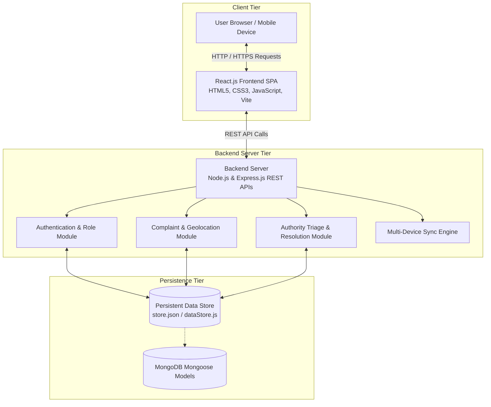
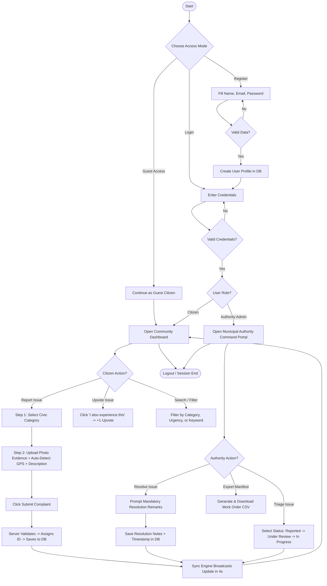
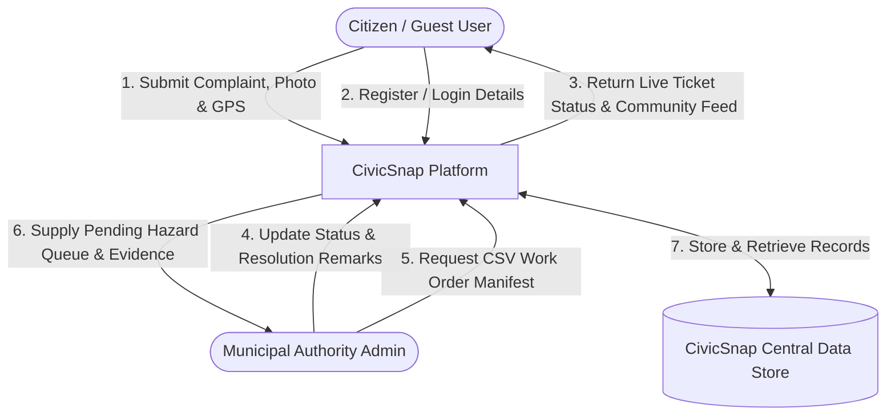
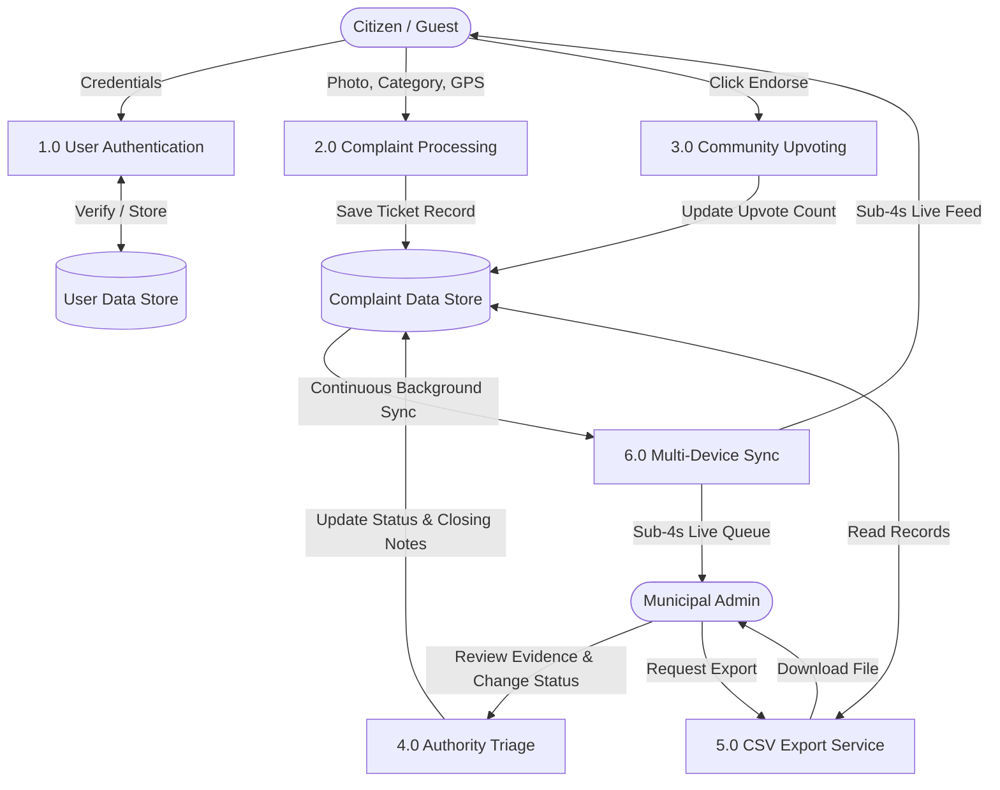
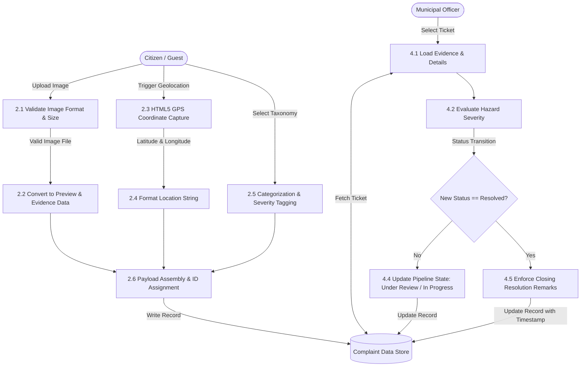
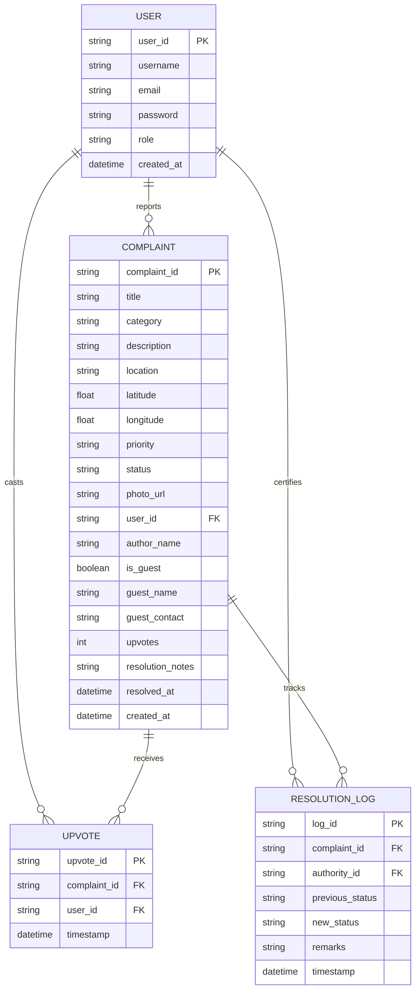
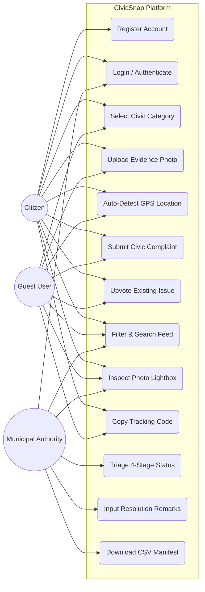

# CIVICSNAP
## MINOR PROJECT REPORT

**Submitted in partial fulfilment of the requirement for the Degree of**  
**Bachelors of Engineering in Computer Science & Engineering**

---

### Submitted To:
**PARUL UNIVERSITY, VADODARA, GUJARAT (INDIA)**  
**DEPARTMENT OF COMPUTER SCIENCE & ENGINEERING**  
**PARUL INSTITUTE OF TECHNOLOGY VADODARA, GUJARAT**  
**SESSION: AY 2025-2026**

---

### Submitted By:
* **Bansi Parmar** (Enrolment No: 2403051057048)
* **Khushi Patel** (Enrolment No: 2403051057057)
* **Priti Rohit** (Enrolment No: 2403051057135)
* **Vasu Machhi** (Enrolment No: 2403051057101)

### Under The Guidance of:
**Mr. Utpal Kumar B. Patel**  
*(Assistant Professor, Department of Computer Science & Engineering)*

---
\pagebreak

## Parul University
### Parul Institute of Technology
**(Session: 2025-2026)**  
**DEPARTMENT OF COMPUTER SCIENCE & ENGINEERING**

---

## CERTIFICATE

This is to certify that **Bansi Parmar**, **Khushi Patel**, **Vasu Machhi**, and **Priti Rohit**, students of **CSE VI Semester** of **Parul Institute of Technology, Vadodara**, have completed their Minor Project titled **"CIVICSNAP PROJECT"**, as per the syllabus and have submitted a satisfactory report on this project as a partial fulfillment towards the award of the degree of **Bachelor of Technology in Computer Science and Engineering** under **Parul University, Vadodara, Gujarat (India)**.

<br><br><br>

| | | |
| :---: | :---: | :---: |
| **Mr. Utpal Kumar B. Patel** | **Asst. Prof. Sumitra Menaria** | **Dr. Swapnil Parikh** |
| (Project Guide) | Head (CSE) | Principal |
| Assistant Professor, CSE | PIT, Vadodara | PIT, Vadodara |

---
\pagebreak

## DECLARATION

We, the undersigned, solemnly declare that the project report **"CIVICSNAP PROJECT"** is based on our own work carried out during the course of our study under the supervision of **Mr. Utpalkumar B. Patel**, Assistant Professor, Department of Computer Science & Engineering.

We assert the statements made and conclusions drawn are the outcomes of our own work. We further certify that:
1. The work contained in the report is original and has been done by us under the general supervision of our supervisor.
2. The work has not been submitted to any other Institution for any other degree / diploma / certificate in this university or any other University of India or abroad.
3. We have followed the guidelines provided by the university in writing the report.

Whenever we have used materials (data, theoretical analysis, and text) from other sources, we have given due credit to them in the text of the report and provided their details in the references.

<br>

* **BANSI PARMAR** [2403051057048] : ___________________________
* **KHUSHI PATEL** [2403051057057] : ___________________________
* **VASU MACHHI** [2403051057101] : ___________________________
* **PRITI ROHIT** [2403051057135] : ___________________________

---
\pagebreak

## ACKNOWLEDGEMENT

In this semester, we have completed our project on **"CIVICSNAP PROJECT"**. During this time, all the group members collaboratively worked on the project and learnt about industry standards regarding how software projects are engineered, deployed, and scaled in modern technology organizations. We also understood the immense importance of teamwork and cross-functional collaboration while creating an end-to-end full-stack web application.

We gratefully acknowledge and express our sincere gratitude for the valuable assistance, cooperation, guidance, and clarification provided by our guide **Mr. Utpalkumar B. Patel** during the development of our project.

We would also like to thank our Head of Department **Prof. Sumitra Menaria** and our Principal **Dr. Swapnil Parikh Sir** for giving us the opportunity, laboratory facilities, and encouragement to develop this project. Their continuous motivation and guidance helped us overcome various technical challenges during implementation.

We perceive this project as a pivotal milestone in our career development. We will strive to use the gained skills and practical engineering knowledge in the best possible way for our future academic and professional endeavors.

<br>

* **BANSI PARMAR** [2403051057048]
* **KHUSHI PATEL** [2403051057057]
* **VASU MACHHI** [2403051057101]
* **PRITI ROHIT** [2403051057135]

---
\pagebreak

## LIST OF FIGURES

| S. No. | Figure No. | Name of Figure | Page No. |
| :---: | :---: | :--- | :---: |
| 1 | Fig. 3.5.1 | System Architecture | 19 |
| 2 | Fig. 3.5.2 | Process Flow Diagram | 20 |
| 3 | Fig. 3.5.3 | DFD Level 0 (Context Diagram) | 21 |
| 4 | Fig. 3.5.4 | DFD Level 1 (System Overview) | 21 |
| 5 | Fig. 3.5.5 | DFD Level 2 (Detailed Functional Decomposition) | 22 |
| 6 | Fig. 3.5.6 | ER Diagram (Entity-Relationship) | 23 |
| 7 | Fig. 3.5.7 | Use Case Diagram | 24 |
| 8 | Fig. 5.1.1 | Website Overview & Hero Section | 29 |
| 9 | Fig. 5.1.2 | Indian Civic Vision & Agenda Section | 29 |
| 10 | Fig. 5.2.1 | User Registration Interface | 30 |
| 11 | Fig. 5.3.1 | User & Authority Login Interface | 30 |
| 12 | Fig. 5.4.1 | Community Feed & Real-Time Dashboard | 31 |
| 13 | Fig. 5.5.1 | Complaint Reporting Wizard (Category Selection) | 32 |
| 14 | Fig. 5.6.1 | Issue Details, Photo Evidence & Geolocation Pinning | 32 |
| 15 | Fig. 5.7.1 | Municipal Authority Portal & Resolution Certification | 33 |

---

## LIST OF ABBREVIATIONS

| S. No. | Abbreviation | Full Form |
| :---: | :--- | :--- |
| 1 | **HTML** | HyperText Markup Language |
| 2 | **CSS** | Cascading Style Sheets |
| 3 | **JS** | JavaScript |
| 4 | **React JS** | React JavaScript Library |
| 5 | **API** | Application Programming Interface |
| 6 | **REST** | Representational State Transfer |
| 7 | **JSON** | JavaScript Object Notation |
| 8 | **DFD** | Data Flow Diagram |
| 9 | **ER** | Entity-Relationship |
| 10 | **UX** | User Experience |
| 11 | **UI** | User Interface |
| 12 | **GPS** | Global Positioning System |
| 13 | **CORS** | Cross-Origin Resource Sharing |
| 14 | **SPA** | Single Page Application |
| 15 | **BMC / BBMP**| Brihanmumbai Municipal Corporation / Bruhat Bengaluru Mahanagara Palike |

---
\pagebreak

## ABSTRACT

The rapid growth of urbanization has significantly increased the volume of civic issues in Indian cities, such as garbage accumulation, hazardous road potholes, drainage overflow, streetlight dark spots, and unhygienic public environments. These issues not only affect the cleanliness of cities but also have a severe negative impact on public safety, daily commuting, and general quality of life. Although municipal authorities provide complaint reporting systems, many existing solutions suffer from major drawbacks such as lack of transparency, delayed response, absence of visual proof, and complete lack of tracking mechanisms.

To overcome these challenges, **CivicSnap** is developed as a smart, accessible, and transparent civic issue reporting web platform. The frontend is built using **HTML5, CSS3, JavaScript, and React.js with Vite** to provide an interactive, responsive user interface contextualized with authentic Indian civic photographs and locations. The backend is powered by **Node.js with Express.js REST APIs** alongside a lightweight, persistent multi-device data engine that ensures seamless live synchronization across mobile phones and desktop computers without requiring complicated cloud database setups.

The platform allows citizens to report civic hazards in under 30 seconds by uploading images alongside automated GPS location detection. It supports both **Guest Users** and **Registered Citizens**, making the platform immediately accessible and encouraging wider public participation. Complaints are categorized across 9 vital civic categories (including Potholes, Swachh Bharat Garbage Dumps, Streetlight Failures, and Water Pipeline Leaks).

To ensure accountability, the system introduces proof-based resolution where municipal authorities manage a 4-stage lifecycle (*Reported → Under Review → In Progress → Resolved*), submit official closing remarks upon resolution, and export municipal manifests to CSV. Community upvoting (*"I also experience this"*) enables citizens to endorse existing issues, preventing duplicate complaints and highlighting critical urban emergencies. Overall, CivicSnap bridges the communication gap between citizens and municipal authorities, reducing response times and fostering cleaner, safer smart cities.

---
\pagebreak

## INDEX

| CHAPTER | TOPIC | PAGE NO. |
| :--- | :--- | :---: |
| **Chapter I** | **INTRODUCTION** | **8 – 10** |
| | 1.1 Overview | 8 |
| | 1.2 Problem Statement | 9 |
| | 1.3 Objective of Project | 9 |
| | 1.4 Applications or Scope | 10 |
| **Chapter II** | **LITERATURE SURVEY** | **11 – 12** |
| | 2.1 Introduction | 11 |
| | 2.2 Existing Systems | 11 |
| | 2.3 Limitations of Existing Systems | 11 |
| | 2.4 Proposed System – CivicSnap | 12 |
| | 2.5 References | 12 |
| **Chapter III** | **METHODOLOGY** | **13 – 24** |
| | 3.1 Methodology | 13 |
| | 3.2 Platforms and Technologies Used | 14 |
| | 3.3 Proposed Methodology & Workflow | 15 |
| | 3.4 Project Modules (Module 1 to Module 7) | 16 – 18 |
| | 3.5 Diagrams | 19 – 24 |
| | &emsp;3.5.1 System Architecture | 19 |
| | &emsp;3.5.2 Process Flow Diagram | 20 |
| | &emsp;3.5.3 DFD Level 0 (Context Diagram) | 21 |
| | &emsp;3.5.4 DFD Level 1 (System Overview) | 21 |
| | &emsp;3.5.5 DFD Level 2 (Detailed Decomposition) | 22 |
| | &emsp;3.5.6 ER Diagram (Entity-Relationship) | 23 |
| | &emsp;3.5.7 Use Case Diagram | 24 |
| **Chapter IV** | **SYSTEM REQUIREMENTS** | **25 – 27** |
| | 4.1 Software and Technologies Used | 25 |
| | 4.2 Hardware Requirements | 26 |
| | 4.6 Summary of Requirements | 27 |
| **Chapter V** | **EXPECTED OUTCOMES WITH GUI** | **28 – 33** |
| | 5.1 Overview of Expected Outcomes | 28 |
| | 5.2 Website Overview & Landing Page Visuals | 29 |
| | 5.3 Registration & Login Page Visuals | 30 |
| | 5.4 Live Community Feed & Dashboard Visuals | 31 |
| | 5.5 Category Selection & Evidence Submission Visuals | 32 |
| | 5.6 Municipal Authority Portal & Resolution Visuals | 33 |
| **Chapter VI** | **CONCLUSION & FUTURE SCOPE** | **34 – 35** |
| | 6.1 Conclusion | 34 |
| | 6.2 Future Work | 34 |
| **Chapter VII**| **REFERENCES** | **36** |

---
\pagebreak

# CHAPTER I: INTRODUCTION

### 1.1 Overview
* Rapid urbanization in Indian cities has led to a significant increase in civic issues such as garbage accumulation, damaged roads, overflowing drainage, and defective street lighting.
* Citizens often face difficulties due to complex, slow, and outdated municipal complaint systems that lack transparency and real-time tracking.
* There is an urgent need for a simple, interactive, and transparent digital platform that allows citizens to report neighborhood issues with photographic evidence and geotagged location data.
* **CivicSnap** is an open civic engagement and municipal issue resolution web platform designed to empower citizens and optimize municipal administration.
* Users can report problems within 30 seconds, attach photos, pinpoint coordinates via GPS, and track the complaint progress from submission to resolution.
* The system automatically organizes complaints across 9 structured categories:
  * Hazardous Potholes & Road Degradation
  * Garbage & Waste Dumps (Swachh Bharat Abhiyan)
  * Illegal Parking & Obstruction
  * Defective Streetlights & Dark Stretches
  * Water Supply & Pipeline Leakage
  * Road & Infrastructure Defects (Open Manholes, Broken Railings)
  * Cleanliness & Street Sweeping
  * Open Waste Burning
  * Other Civic Hazards
* CivicSnap features a **Live Multi-Device Synchronization Engine** that reflects complaint submissions and status updates across smartphones and administrative laptops in under 4 seconds.
* To eliminate duplicate complaints, the platform introduces a Community Endorsement (*"I also experience this"*) upvoting feature that aggregates public urgency.
* The platform enforces **Proof-Based Resolution**, requiring municipal authorities to provide certified closing notes and timestamps before resolving issues.
* The system supports flexible dual access modes:
  * **Verified Citizen Account**: Profile tracking, community upvoting, and personal submission history.
  * **Guest Reporting Mode**: Zero-friction issue reporting without mandatory prior account registration.
  * **Municipal Authority Portal**: Administrative queue management, 4-stage status pipelines, and CSV manifest export.

### 1.2 Problem Statement
* In rapidly growing urban centers, civic hazards negatively impact daily life, cause severe vehicular damage, compromise sanitation, and trigger dangerous road accidents.
* Traditional grievance reporting methods (paper registers, physical ward office visits, and telephonic helplines) are time-consuming and lack accountability.
* Inability to attach photographic evidence leads to misunderstandings between citizens and field engineers regarding the true scale of the hazard.
* Subjective location descriptions (*"near the temple"* or *"behind the shop"*) lead to misdirected municipal squads and delayed remediation.
* Citizens have zero visibility into their complaint progress, creating a communication vacuum and diminishing civic trust.
* Multiple separate complaints are filed for the same issue, creating duplicate tickets that overwhelm municipal administration.
* Therefore, there is a clear need for an intelligent, photo-driven, geotagged, and transparent civic issue resolution platform that bridges the gap between citizens and urban local bodies.

### 1.3 Objective of Project
* To design and develop an accessible, responsive web application for civic issue reporting and management.
* To allow citizens to upload image evidence with automated GPS latitude and longitude coordinate capture.
* To democratize civic participation by supporting both Registered Citizens and a friction-free Guest Reporting Mode.
* To classify civic complaints across 9 standardized municipal domains for efficient departmental triage.
* To eliminate duplicate reports through a Community Endorsement ("Upvote") mechanism.
* To provide real-time 4-stage status tracking (*Reported → Under Review → In Progress → Resolved*).
* To establish proof-based resolution by mandating official administrative remarks before tickets are marked resolved.
* To ensure multi-device synchronization so reports filed on smartphones appear dynamically on authority laptops.
* To provide municipal authorities with queue triage tools and one-click CSV work order export.
* To promote the national vision of smart city governance and the Swachh Bharat Mission.

### 1.4 Applications or Scope
* **Civic Issue Reporting System**: Enables citizens to report potholes, garbage dumps, dark streetlights, and pipeline leaks in under 30 seconds.
* **Municipal Authority Command Center**: Equips ward officers and field engineers with a prioritized complaint queue and actionable dispatch details.
* **Swachh Bharat Support**: Facilitates rapid identification of overflowing waste bins, open burning, and sanitation hazards.
* **Public Transparency & Audit**: An open Community Feed allows residents to view civic progress in their neighborhoods.
* **Field Squad Work Orders**: One-click CSV export enables field engineers to print work manifests for road repair squads.
* **Data-Driven Urban Planning**: Collects empirical historical records of frequent infrastructure failures to aid municipal budget allocation.
* **Progressive Web Access**: Fully responsive on mobile phones, tablets, and desktop browsers without native app download requirements.

---
\pagebreak

# CHAPTER II: LITERATURE SURVEY

### 2.1 Introduction
* Maintaining urban infrastructure and environmental hygiene is vital for public health and city livability.
* Traditional municipal grievance redressal mechanisms are predominantly manual, slow, and lack transparency.
* With the growth of digital governance, various civic platforms have emerged to streamline complaint redressal.
* This literature survey reviews existing municipal redressal mechanisms, analyzes contemporary platforms, and outlines the architectural necessity of CivicSnap.

### 2.2 Existing Systems
* **Manual Paper Registers & Physical Visits**: Citizens visit ward offices during limited operating hours to fill out paper grievance forms. These forms are prone to loss, misplacement, and manual routing delays.
* **Telephonic Helplines**: Calling municipal call centers results in busy lines, subjective verbal logging by operators, and zero photographic verification.
* **Government Portals (e.g., CPGRAMS, Swachhata App)**: While national portals exist, many suffer from cumbersome navigation, mandatory identity authentication hurdles, and slow desktop-heavy interfaces that discourage casual reporting.
* **Social Media Outlets (Twitter / WhatsApp)**: Citizens frequently tweet issues to municipal handles. However, tweets lack structured categorization, automated GPS coordinates, formal resolution lifecycles, and data export tools.

### 2.3 Limitations of Existing Systems
* **High Barrier to Entry**: Mandatory registration blocks citizens from quickly reporting roadside emergencies.
* **No Visual Accountability**: Tickets are frequently closed administratively without verified before/after proof or official remarks.
* **Duplicate Ticket Clutter**: Dozens of independent complaints for the same road defect overwhelm administrative staff.
* **Lack of Real-Time Multi-Device Sync**: Administrative dashboards require manual reloads to check for newly filed issues.
* **Subjective Location References**: Absence of GPS coordinates leads to squad dispatch errors.

### 2.4 Proposed System – CivicSnap
* To resolve these limitations, **CivicSnap** is developed as an open, accessible, photo-driven civic platform.
* Enables instant reporting with photographic evidence, automated GPS coordinate detection, and severity selection.
* Supports **Guest Mode** (zero registration barrier) alongside **Verified Citizen** and **Municipal Authority** roles.
* Introduces a **Community Endorsement Engine** that aggregates public urgency onto a single ticket via upvotes.
* Provides **Proof-Based Resolution** requiring municipal authorities to enter official remarks before closing tickets.
* Implements a **Live Multi-Device Synchronization Layer** ensuring sub-4-second updates across devices.
* Integrates authentic Indian civic visuals (Swachh Bharat bins, Indian road potholes, TATA repair vehicles, BBMP/BMC markers).

### 2.5 References
* React.js Official Documentation: [https://react.dev/](https://react.dev/)
* Node.js Server Environment: [https://nodejs.org/docs](https://nodejs.org/docs)
* Express.js REST Framework: [https://expressjs.com/](https://expressjs.com/)
* MDN Geolocation API: [https://developer.mozilla.org/en-US/docs/Web/API/Geolocation_API](https://developer.mozilla.org/en-US/docs/Web/API/Geolocation_API)
* Swachh Bharat Urban Mission Guidelines: [https://swachhbharaturban.gov.in/](https://swachhbharaturban.gov.in/)

---
\pagebreak

# CHAPTER III: METHODOLOGY

### 3.1 Methodology
The methodology of CivicSnap follows a structured, modular workflow:
1. **Web-Based Client-Server Approach**: Developed as a responsive Single Page Application (SPA) communicating with an asynchronous REST API backend.
2. **Citizen Capture & Input Stage**: Users upload photographic evidence, select a category, write an optional description, and capture GPS coordinates via the HTML5 Geolocation API.
3. **Data Validation & Sanitization**: The backend validates payload fields, prevents empty submissions, normalizes coordinate floats, and assigns a unique complaint tracking ID.
4. **Persistent Data Storage**: Records are saved into the server-side persistent store (`dataStore.js`), backed by Mongoose document models.
5. **Community Endorsement & Upvoting**: Citizens viewing the Community Feed endorse existing issues, automatically updating the priority ranking.
6. **Multi-Device Background Synchronization**: A lightweight synchronization service polls the backend every 4 seconds, propagating new tickets and status updates to all active clients.
7. **Municipal Triage & Resolution**: Ward officers view assigned complaints, inspect high-resolution evidence, transition tickets across the 4-stage pipeline, log closing remarks, and export work orders to CSV.

### 3.2 Platforms and Technologies Used
* **Frontend Technologies (HTML5, CSS3, JavaScript ES6+, React.js)**:
  * **HTML5**: Semantic markup, accessible forms, and native camera/file input integration.
  * **CSS3**: Design system tokens, modern glassmorphism, responsive grid layouts, and micro-interactions.
  * **JavaScript (ES6+)**: Asynchronous promise handling, client-side filtering, and local data caching.
  * **React.js 18 with Vite**: Virtual DOM diffing, component modularity, and lightning-fast build optimization.
* **Backend Platform (Node.js with Express.js Framework)**:
  * **Node.js**: Non-blocking asynchronous runtime executing server logic with high concurrency.
  * **Express.js**: REST API routing, CORS handling, and middleware request pipeline.
* **Data Storage Layer**:
  * **Persistent Data Store (`dataStore.js`)**: Server-side JSON-backed storage ensuring multi-device synchronization without external database dependencies.
  * **MongoDB Mongoose Models**: Document schemas defining `Complaint` and `User` entities for enterprise scaling.
* **Development & Deployment Environment**:
  * Visual Studio Code, Git, GitHub, Vercel Global Edge Network, Render Cloud Web Services.

### 3.3 Proposed Methodology & Architecture Workflow
```
[ Citizen Smartphone ] ---> (POST /api/complaints) ---> [ Express.js Backend ]
[ Authority Laptop   ] ---> (PATCH /status, /upvote) --> [ Express.js Backend ]
                                                               |
                                                               v
                                                    [ Persistent Data Store ]
                                                               |
                                                               v
[ Multi-Device Sync Engine (4s) ] <----------------------------+
         |
         +-----> [ Real-Time Updates Broadcast to Mobile & Desktop Clients ]
```

---
\pagebreak

### 3.4 Project Modules

#### Module 1: User Authentication & Role Management
* **Citizen Registration & Login**: Validates credentials and initializes session tokens.
* **Role-Based Access Control**:
  * **Citizen**: Accesses Community Feed, files issues, and upvotes hazards.
  * **Municipal Authority (`admin@civicsnap.com`)**: Unlocks Authority Portal, status transition buttons, and CSV export.
  * **Guest Mode**: Allows instant reporting without requiring login credentials.

#### Module 2: Complaint Submission & Geolocation Wizard
* **2-Step Wizard Interface**: Step 1 selects hazard taxonomy; Step 2 captures evidence details.
* **GPS Coordinate Auto-Detection**: Uses HTML5 Geolocation to automatically populate exact latitude and longitude coordinates.
* **Photographic Evidence Attachment**: Reads image files locally using `FileReader`, validates file size (< 5 MB), and generates preview thumbnails.

#### Module 3: Category Taxonomy & Departmental Routing
* Automatically groups complaints across 9 standardized municipal domains:
  1. Road Potholes
  2. Garbage & Waste Dumps
  3. Illegal Parking
  4. Streetlight Failures
  5. Water Pipeline Leaks
  6. Road & Infrastructure Defects
  7. Street Cleanliness & Sweeping
  8. Open Waste Burning
  9. General Civic Hazards

#### Module 4: Community Feed & Interactive Discovery
* **Real-Time Filtering**: Instant filtering by category pills, keyword search, and urgency status.
* **Evidence Lightbox Modal**: Enables one-click expansion of complaint evidence photos for detailed visual inspection.
* **Tracking Code Clipboard**: Allows citizens to copy unique tracking codes (`#c1`, `#c2`) to share with local neighborhood groups.

#### Module 5: Community Endorsement (Upvoting) Module
* Allows citizens to click *"I also experience this"*.
* Atomically increments the complaint's upvote count in the persistent store.
* Naturally prioritizes severe neighborhood hazards without creating duplicate ticket clutter.

#### Module 6: Municipal Authority Triage & Resolution Certification
* **4-Stage Lifecycle Progression**:
  $$\text{Reported} \longrightarrow \text{Under Review} \longrightarrow \text{In Progress} \longrightarrow \text{Resolved}$$
* **Resolution Certification Dialog**: Enforces mandatory entry of official closing remarks before an issue can be marked "Resolved".
* **CSV Manifest Export**: Generates downloadable CSV manifests containing complaint IDs, locations, categories, GPS coordinates, and descriptions for squad dispatch.

#### Module 7: Multi-Device Synchronization & Resilient Store
* Runs background polling (4-second interval) against the cloud backend.
* Automatically synchronizes complaint state across smartphones, tablets, and laptops.
* Features local browser caching (`localStorage`) to guarantee zero-crash offline resilience.

---
\pagebreak

### 3.5 Diagrams

#### 3.5.1 System Architecture

*(Fig. 3.5.1 : System Architecture Diagram)*

---
\pagebreak

#### 3.5.2 Process Flow Diagram

*(Fig. 3.5.2 : Process Flow Diagram)*

---
\pagebreak

#### 3.5.3 DFD Level 0 (Context Diagram)

*(Fig. 3.5.3 : DFD Level 0 – Context Diagram)*

<br>

#### 3.5.4 DFD Level 1 (System Overview)

*(Fig. 3.5.4 : DFD Level 1 – Structured System Overview)*

---
\pagebreak

#### 3.5.5 DFD Level 2 (Detailed Functional Decomposition)

*(Fig. 3.5.5 : DFD Level 2 – Functional Decomposition of Complaint Lifecycle)*

---
\pagebreak

#### 3.5.6 ER Diagram (Entity-Relationship)

*(Fig. 3.5.6 : Entity-Relationship Diagram with Keys & Cardinality)*

---
\pagebreak

#### 3.5.7 Use Case Diagram

*(Fig. 3.5.7 : Complete System Use Case Diagram)*

---
\pagebreak

# CHAPTER IV: SYSTEM REQUIREMENTS

### 4.1 Software and Technologies Used
The CivicSnap platform is developed using the following technologies:

#### 1. Backend Technology
* **Node.js**:
  * Serves as the asynchronous, event-driven JavaScript server runtime.
  * Capable of handling high volumes of simultaneous HTTP connections with minimal overhead.
  * Manages server-side data persistence, validation, and multi-device state coordination.
* **Express.js Framework**:
  * Lightweight web application framework managing RESTful API endpoints.
  * Provides middleware routing for authentication, CORS headers, error handling, and JSON parsing.

#### 2. Database & Persistence Management
* **Standalone Persistent Data Store (`dataStore.js`)**:
  * Server-side persistent file storage managing `store.json`.
  * Guarantees zero-dependency multi-device sync without requiring external database accounts.
* **MongoDB Mongoose Models**:
  * Provides structured schemas (`Complaint.js`, `User.js`) for enterprise MongoDB Atlas scalability.

#### 3. Frontend Technologies
* **HTML5**:
  * Semantic structuring of application components, forms, and camera inputs.
  * Native integration with the HTML5 Geolocation API for GPS coordinate retrieval.
* **CSS3**:
  * Custom design tokens, dark glassmorphism, responsive flexbox/grid layouts, and micro-animations.
* **JavaScript (ES6+)**:
  * Modern modular JavaScript handling async/await API calls, state mapping, and local storage fallback.
* **React.js 18 with Vite**:
  * Component-driven single page application delivering instant view rendering and fast hot-module replacement.

#### 4. Development & Cloud Deployment Tools
* **Visual Studio Code**: Primary code editor used for development and debugging.
* **Git & GitHub**: Version control and collaborative code management.
* **Vercel Edge Platform**: Global CDN hosting for the optimized frontend bundle.
* **Render Cloud Services**: Continuous cloud web service hosting the Express.js backend.

### 4.2 Hardware Requirements

#### Client Devices (Citizen & Authority):
* **Processor**: Intel Core i3 or modern ARM mobile CPU (Qualcomm / MediaTek / Apple Silicon).
* **RAM**: Minimum 2 GB (4 GB recommended).
* **Storage**: 100 MB free browser cache space.
* **Network**: Active 3G/4G/5G mobile connection or Wi-Fi.

#### Server Platform (Production Hosting):
* **Processor**: Dual-core 2.0 GHz CPU or Cloud Micro Instance.
* **RAM**: Minimum 1 GB (2 GB recommended).
* **Storage**: 1 GB persistent SSD storage.
* **Network**: High-speed cloud internet with public static HTTPS routing.

### 4.6 Summary of Requirements
* The system uses a modern, decoupled client-server architecture built on React and Node.js.
* Operates smoothly across any modern browser without requiring native application installation.
* Features a self-contained persistent store that eliminates external cloud database subscription costs.

---
\pagebreak

# CHAPTER V: EXPECTED OUTCOMES WITH GUI

### 5.1 Overview of Expected Outcomes
CivicSnap delivers a unified, high-performance web experience that bridges the gap between citizens and municipal authorities. Key visual outcomes include:
* Modern dark glassmorphic landing page highlighting civic impact and the Swachh Bharat mission.
* Zero-friction reporting with camera attachment and GPS geolocation.
* Real-time Community Feed with live upvotes, status badges, and search filters.
* Dedicated Municipal Authority Portal with 4-stage status triage, certified closing remarks, and CSV export.

---

### 5.2 Website Overview & Landing Page Visuals
The landing page introduces citizens to CivicSnap, highlighting real-time statistics, the civic agenda, municipal maintenance squads, and an interactive reporting entry point.

```
===================================================================================
                                   CIVICSNAP
  [Home]   [Our Agenda]   [Municipal Command]   [How It Works]       (Sign In)
===================================================================================

    Empowering Citizens.
    Accelerating Municipal Resolution.
    
    Report potholes, overflowing waste dumps, dark streetlights,
    and pipeline leaks directly to municipal squads.

    [ (Report Civic Hazard) ]     [ (Explore Community Feed) ]

    +--------------------------------------------------------------------------+
    | [PHOTO: Indian Citizen using Smartphone to Report Pothole on City Street]|
    |                                                                          |
    |  +-- Verified Live Ticket --------------------------------------------+  |
    |  | Hazardous Pothole Pinpointed                                       |  |
    |  | Loc: MG Road near Metro Pillar 42   | Severity: EMERGENCY          |  |
    |  | Reported: 2 mins ago                | Status: UNDER REVIEW         |  |
    |  +--------------------------------------------------------------------+  |
    +--------------------------------------------------------------------------+
```
*(Fig. 5.1.1 : CivicSnap Hero Section & Live Ticket Card)*

```
===================================================================================
                           OUR AGENDA & CIVIC VISION
===================================================================================

  +--------------------------------------------+  The Civic Vision:
  | [PHOTO: Clean Green Indian Residential     |  Clean, Safe, and Thriving
  |  Neighborhood Colony in Bengaluru / Delhi] |  
  |                                            |  * Zero Pothole Roadways
  |  Verified Fix: Paved sidewalks & trees     |  * Swachh Bharat Waste Clearing
  +--------------------------------------------+  * 24-Hour Municipal Triage
```
*(Fig. 5.1.2 : Indian Civic Vision & Agenda Section)*

---
\pagebreak

### 5.3 Registration & Login Page Visuals
Provides secure account creation, role-based authentication, and instant Guest Mode access.

```
+-------------------------------------------------------------+
|                      Create an Account                      |
|                  Join CivicSnap Community                   |
|                                                             |
|  FULL NAME                                                  |
|  [ Aarav Sharma                                           ] |
|                                                             |
|  EMAIL ADDRESS                                              |
|  [ aarav@civicsnap.com                                    ] |
|                                                             |
|  PASSWORD                                                   |
|  [ ••••••••••••••••                                       ] |
|                                                             |
|  ROLE SELECTION                                             |
|  (•) Verified Citizen       ( ) Municipal Authority Officer |
|                                                             |
|                     [ Register Account -> ]                 |
|                                                             |
|                Already have an account? Log in              |
+-------------------------------------------------------------+
```
*(Fig. 5.2.1 : User Registration Interface)*

<br>

```
+-------------------------------------------------------------+
|                        Welcome Back                         |
|                 Sign in to access CivicSnap                 |
|                                                             |
|  EMAIL ADDRESS                                              |
|  [ admin@civicsnap.com                                    ] |
|                                                             |
|  PASSWORD                                                   |
|  [ ••••••••••••••••                                       ] |
|                                                             |
|                        [ Sign In -> ]                       |
|                                                             |
|  --------------------------- OR --------------------------- |
|                                                             |
|               [ Continue as Guest Citizen ]                 |
+-------------------------------------------------------------+
```
*(Fig. 5.3.1 : Secure Login Interface with Guest Access)*

---
\pagebreak

### 5.4 Live Community Feed & Dashboard Visuals
Displays all active municipal reports in an interactive, searchable card grid with real-time upvotes and status badges.

```
===================================================================================
 CIVICSNAP DASHBOARD       [ Search by keyword... ]   (Report Issue) [Authority Mode]
===================================================================================

 [All Issues]  [Potholes]  [Garbage Dumps]  [Streetlights]  [Pipeline Leaks]

 +------------------------------------+  +------------------------------------+
 | [PHOTO: Indian Road Pothole]       |  | [PHOTO: Swachh Bharat Dumpster]    |
 | Category: Potholes                 |  | Category: Garbage & Waste Dumps    |
 | Severity: EMERGENCY                |  | Severity: HIGH                     |
 | Status: [ IN PROGRESS ]            |  | Status: [ REPORTED ]               |
 |                                    |  |                                    |
 | Hazardous Pothole on Arterial Road |  | Overflowing Municipal Waste Bin    |
 | Loc: MG Road near Metro Pillar 42  |  | Loc: Central Park East Gate        |
 | Reported by: Commuter Daily        |  | Reported by: John Citizen          |
 |                                    |  |                                    |
 | [ ▲ I also experience this (27) ]  |  | [ ▲ I also experience this (14) ]  |
 | [ Copy Tracking Code: #c2 ]        |  | [ Copy Tracking Code: #c1 ]        |
 +------------------------------------+  +------------------------------------+
```
*(Fig. 5.4.1 : Real-Time Community Feed & Issue Grid)*

---
\pagebreak

### 5.5 Category Selection & Evidence Submission Visuals
The 2-step modal reporting wizard ensures easy categorization, image evidence attachment, and GPS geolocation capture.

```
+-----------------------------------------------------------------------------+
|                      Report Civic Hazard - Step 1 of 2                      |
|                        Select Issue Classification                          |
|                                                                             |
|  +---------------------------+  +---------------------------+               |
|  | (!) Hazardous Potholes    |  | (T) Garbage & Waste Dumps |               |
|  | Road craters & sinkholes  |  | Overflowing refuse bins   |               |
|  +---------------------------+  +---------------------------+               |
|  +---------------------------+  +---------------------------+               |
|  | (P) Illegal Parking       |  | (*) Streetlight Faults    |               |
|  | Sidewalk & gate blockages |  | Dark stretches & outages  |               |
|  +---------------------------+  +---------------------------+               |
|  +---------------------------+  +---------------------------+               |
|  | (~) Water Pipeline Leaks  |  | (#) Road Infrastructure   |               |
|  | Burst pipes & drainage    |  | Open manholes & rails     |               |
|  +---------------------------+  +---------------------------+               |
|                                                                             |
|                          [ Continue to Details -> ]                         |
+-----------------------------------------------------------------------------+
```
*(Fig. 5.5.1 : Step 1 – Category Selection Wizard)*

<br>

```
+-----------------------------------------------------------------------------+
|                      Report Civic Hazard - Step 2 of 2                      |
|                       Provide Evidence & Location                           |
|                                                                             |
|  ATTACH EVIDENCE PHOTOGRAPH                                                 |
|  +-----------------------------------------------------------------------+  |
|  | [ /images/road-pothole.jpg (Preview: Deep asphalt crater with water) ]|  |
|  +-----------------------------------------------------------------------+  |
|                                                                             |
|  LOCATION & LANDMARK                                                        |
|  [ MG Road near Metro Pillar 42                                         ]   |
|  [ Auto-Detect GPS: Lat 28.6250, Long 77.2180 (Pinned Successfully)     ]   |
|                                                                             |
|  SEVERITY LEVEL                                                             |
|  ( ) Low Priority   ( ) Medium Priority   ( ) High Priority   (•) EMERGENCY |
|                                                                             |
|  DESCRIPTION                                                                |
|  [ Deep pothole post-monsoon causing wheel damage and severe traffic... ]   |
|                                                                             |
|                        [ Submit Civic Report ]                              |
+-----------------------------------------------------------------------------+
```
*(Fig. 5.6.1 : Step 2 – Evidence Attachment & GPS Coordinate Pinning)*

---
\pagebreak

### 5.6 Municipal Authority Portal & Resolution Visuals
The Authority Portal enables officers to triage tickets across the 4 stages, enter mandatory closing remarks, and export work orders to CSV.

```
===================================================================================
 MUNICIPAL AUTHORITY COMMAND PORTAL                       [ Download CSV Manifest ]
 Logged in: Municipal Officer (admin@civicsnap.com)       Active Queue: 4 Issues
===================================================================================

 TICKET #c2 : Hazardous Pothole on Arterial Road
 Location: MG Road near Metro Pillar 42 | Priority: EMERGENCY
 Community Impact: 27 Citizens Impacted

 4-Stage Lifecycle Progression:
 [ Reported ]  --->  [ Under Review ]  --->  [ In Progress ]  --->  [ (Mark Resolved) ]

 +-- Resolution Certification Modal -------------------------------------------+
 | Enter Official Municipal Closing Remarks:                                    |
 |                                                                              |
 | [ Ward 12 road maintenance crew dispatched. Cold patch asphalt applied       |
 |   and roller compaction completed on Sept 8, 2026. Certified resolved.   ]  |
 |                                                                              |
 |                       [ Certify & Close Ticket ]                             |
 +------------------------------------------------------------------------------+
```
*(Fig. 5.7.1 : Municipal Authority Command Portal & Resolution Certification)*

---
\pagebreak

# CHAPTER VI: CONCLUSION & FUTURE SCOPE

### 6.1 Conclusion
* **CivicSnap** provides an intelligent, accessible, and transparent digital platform for reporting and managing urban civic hazards across Indian cities.
* It allows citizens to submit geotagged complaints with photographic evidence in under 30 seconds, eliminating manual paperwork and ambiguous reporting.
* The system enhances municipal accountability through a structured 4-stage lifecycle and enforces proof-based resolution with mandatory closing remarks.
* The Community Endorsement (upvoting) mechanism successfully aggregates public urgency and prevents duplicate ticket clutter.
* Engineered using **React.js, Node.js, and Express.js REST APIs**, the platform establishes a high-performance, lightweight architecture with sub-4-second multi-device live synchronization.
* By contextualizing the interface with authentic Indian civic photographs and infrastructure domains, CivicSnap bridges the communication gap between citizens and urban local bodies, directly supporting the development of cleaner, smarter cities.

### 6.2 Future Work
* **AI Computer Vision Hazard Detection**: Integrating deep learning models (YOLO / CNNs) to automatically detect pothole depth and dumpster overflow levels from uploaded photos.
* **WhatsApp Chatbot Integration**: Enabling citizens to report issues by forwarding photos and live locations directly to a municipal WhatsApp Business account.
* **Automated Ward GIS Geofencing**: Automatically assigning tickets to specific ward junior engineers using GeoJSON administrative boundary maps.
* **SMS Gateway Integration**: Sending automated SMS notifications to citizens via Indian government gateways (NIC / CDAC) when ticket status changes.
* **Citizen Gamification & Leaderboards**: Rewarding active civic contributors with digital community recognition badges and municipal appreciation certificates.

---
\pagebreak

# CHAPTER VII: REFERENCES

1. **React.js Documentation** – [https://react.dev/](https://react.dev/) – Official documentation for React component architecture, virtual DOM diffing, and state management.
2. **Node.js Documentation** – [https://nodejs.org/docs](https://nodejs.org/docs) – Specifications for asynchronous event-driven JavaScript server runtime.
3. **Express.js Framework Documentation** – [https://expressjs.com/](https://expressjs.com/) – Routing architectures, REST endpoints, and middleware pipeline engineering.
4. **MDN Web Docs: Geolocation API** – [https://developer.mozilla.org/en-US/docs/Web/API/Geolocation_API](https://developer.mozilla.org/en-US/docs/Web/API/Geolocation_API) – Browser location services for latitude and longitude retrieval.
5. **MDN Web Docs: Fetch API** – [https://developer.mozilla.org/en-US/docs/Web/API/Fetch_API](https://developer.mozilla.org/en-US/docs/Web/API/Fetch_API) – Client-side asynchronous HTTP request handling.
6. **HTML Living Standard** – [https://html.spec.whatwg.org](https://html.spec.whatwg.org) – Specifications for modern semantic web markup.
7. **CSS Cascading Style Sheets Level 3** – [https://www.w3.org/Style/CSS](https://www.w3.org/Style/CSS) – Design token implementation, glassmorphism, and responsive layout styling.
8. **JSON Standard (ECMA-404)** – [https://www.json.org](https://www.json.org) – Standard for client-server data interchange and local file persistence.
9. **MongoDB Documentation** – [https://www.mongodb.com/docs](https://www.mongodb.com/docs) – Schema modeling with Mongoose ODM for scalable document storage.
10. **OWASP Top 10 Web Application Security Risks** – [https://owasp.org/www-project-top-ten](https://owasp.org/www-project-top-ten) – Best practices for input sanitization, cross-origin resource sharing (CORS), and authentication security.
11. **Fielding, R. T. (2000)**. *Architectural Styles and the Design of Network-based Software Architectures*. Doctoral dissertation, UC Irvine – Foundational specifications for REST architectural style.
12. **Swachh Bharat Urban Mission Guidelines** – [https://swachhbharaturban.gov.in/](https://swachhbharaturban.gov.in/) – National benchmarks for urban cleanliness and waste disposal standards.
